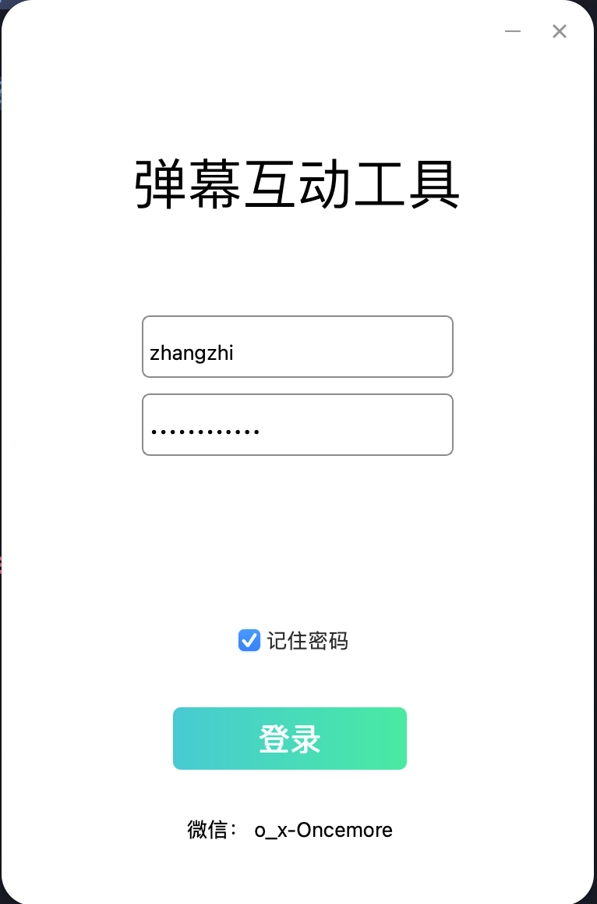
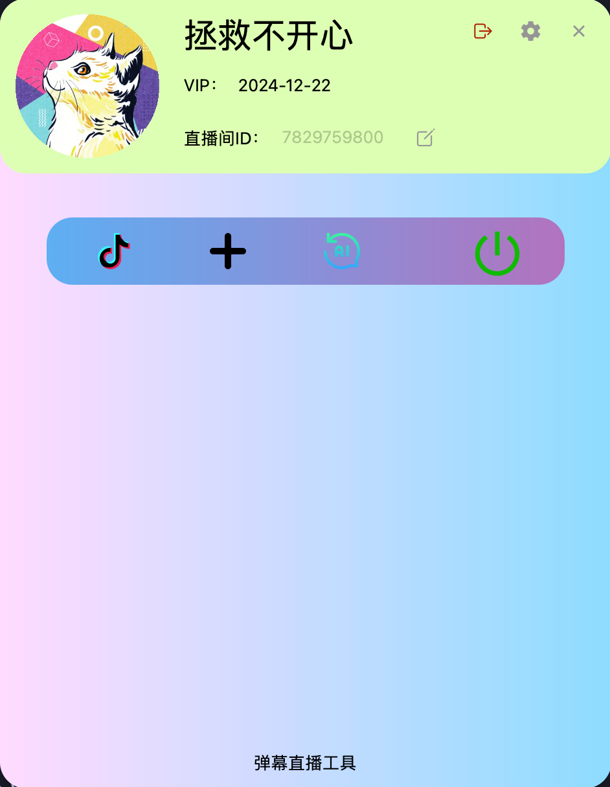

# 抖音弹幕直播工具

根据抖音弹幕内容，接入一些服务进行互动直播。

- 接入了Midjourney，自动生成图片。

## 截图

<div style="display:inline-block">


</div>

## 说明

通过解析在线的直播页面获取主播以及直播间的一些信息，再通过 ws 连接抖音的直播服务，解析获取到的弹幕消息以及礼物消息，获取观众输入的 prompt 用来生成图片。

- 客户端：pyside6
- 服务端：fastapi
- 图片展示服务：vue

## 运行

拉取代码

```bash
  git clone https://link-to-project
```

### 后端

```bash
  cd BulletScreenService
  cd backend
```

安装依赖

```bash
  pip install -r requirements.txt
```

根据 core/config.py 中的字段，在 backend 目录下添加 `.env` 文件并填入 mongodb 的配置。

启动后端

```bash
uvicorn main:app --reload --port 8081
```

**注意：这里我用的是朋友做的 MJ 的接口，所以如果需要使用，需要自己开发请求 MJ 的相关功能，一个请求一个回调。**

### 客户端

客户端部分使用 pyside6 进行开发，结构是使用 briefcase 生成的。

```bash
  cd ..
  cd dmplay
```

使用你常用的工具创建虚拟环境，安装依赖。

```bash
  pip install briefcase
```

启动开发环境

```bash
briefcase dev
```

详细实用方法可以看看briefcase的文档。[Briefcase 0.3.17](https://briefcase.readthedocs.io/en/stable/)

### 图片预览页面

这部分是开始为了方便观众寻找下载自己生成的图片所开发的，页面比较简单，就是一个图片瀑布流。

安装依赖

```
# yarn
yarn

# npm
npm install

# pnpm
pnpm install
```

开发环境

```
# yarn
yarn dev

# npm
npm run dev

# pnpm
pnpm dev
```

发布正式环境

```
# yarn
yarn build

# npm
npm run build

# pnpm
pnpm build
```

## 其他

[FastAPI](https://fastapi.tiangolo.com/)

[Quick start - Qt for Python](https://doc.qt.io/qtforpython-6/quickstart.html)

[Briefcase 0.3.17](https://briefcase.readthedocs.io/en/stable/)

## License

[MIT](https://choosealicense.com/licenses/mit/)
